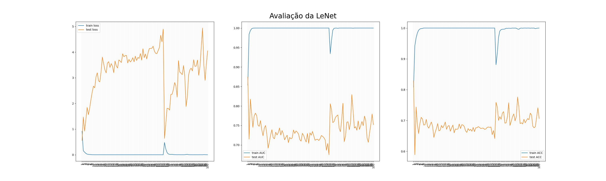

# Pneumo-CNN

Esse é um projeto de classificação de imagens de raio-x de pulmões com e sem pneumonia. Nesse projeto vou cobrir os pontos do processo de ciência de dados:

Ou seja, utilizando dados já coletados irei entende-los, prepara-los e ao final criarei e avaliarei alguns modelos para solução do problema.

# O problema

#### Você consegue saber se uma pessoa tem ou não pneumonia somente olhando para um raio-x do pulmão dela? Eu não ... 

O trabalho nesse repositório usa redes neurais convolucionais para te ajudar a repsonder essa pergunta. Vou me basear em arquiteturas famosas para resolver esse problema. Esse problema foi aprensentado no [kaggle](https://www.kaggle.com/paultimothymooney/chest-xray-pneumonia) em 2018. Seguirei a descrição das classes conforme a tabela abaixo:

|  Classe  	| Representação 	| Significado 	|
|:--------:	|:-------------:	|:---------:	|
| Positiva 	|       1       	| Pneumonia 	|
| Negativa 	|       0       	|   Normal  	|

E como esse é um trabalho de classificação envolvendo saúde irei analisar métricas que tentam diminuir a quantidade de Falsos Negativos (erros do tipo 2), ou seja, minizar a chance de classificarmos como saudável uma pessoa que na verdade possui pneumonia.

# Dados

O dataset consiste de imagens de raio-x de pulmões saudáveis e com pneumonia. São mais de 5 mil imagens, divididas em treino, teste e validação. Para esse trabalho utilzarei somente as de imagens de treino e teste. As imagens possuem tamanhos especificos e não padronizados o que é um problema para nossas redes neurais.

Criei uma classe chamada DataLoader que carrega e faz um resize de todas as imagens. Resultado:

A classe DataLoader também é capaz de controlar a quantidade de imagens carregadas para treino e teste colhendo a quantidade especificada das pastas necessárias.

# Os modelos

## LeNet

Resultados:

## AlexNet

Resultados:

## VGG

Resultados:

# Referências

